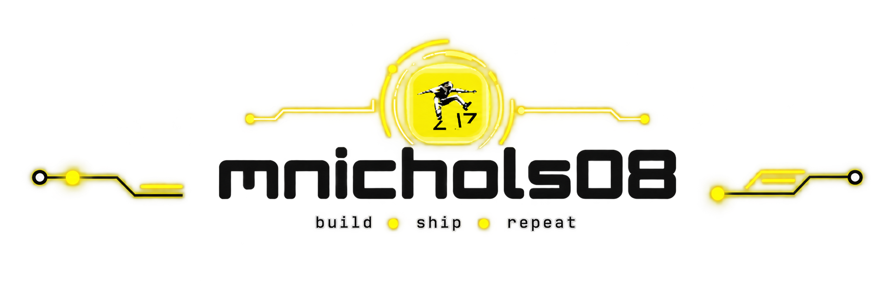

<a href="https://mnix.dev" target="_blank">
<picture>
  <source media="(prefers-color-scheme: dark)" srcset="./assets/banner-dark.png">
  
</picture>
</a>

 

  
  
  

  
  
  

---

# About Me

I'm a **full-stack developer** building web applications with JavaScript, React, Node.js, APIs, and modern browser technologies.

I enjoy building the feature, but I'm equally interested in the engineering around it: **testing, accessibility, authentication, application architecture, deployment, debugging, and making frontend and backend systems work well together.**

I also spend a lot of time exploring **Web Components**, progressive web applications, automated testing, and the parts of software development that make an application easier to maintain after the first version ships.

---

# Technical Stack

## Frontend

  
  
  
  
  

## Backend & APIs

  
  
  
  

## Testing & Quality

  
  
  
  

## Workflow & Deployment

  
  
  
  
  
  
  

---

# Selected Work

### 🌱 [Sprout](https://mnix.dev/projects/sprout)

**Financial Literacy Platform · Full-Stack · Team Practicum**

A financial-literacy application for people learning to manage their first paychecks, bank accounts, and bills.

**My role:** Co-Project Lead · Full-Stack Developer · Testing Lead

`React` `Node.js` `Express` `MongoDB` `JavaScript` `OAuth` `Automated Testing`

---

### 🥫 [Kitchen Inventory](https://mnix.dev/projects/kitchen-inventory)

**Full-Stack Inventory Application · Individual Capstone**

Tracks food, expiration dates, and shopping needs across the fridge, freezer, and pantry.

Built the inventory interface, persistence layer, serverless Airtable integration, filtering, search, and automated tests.

`React` `Vite` `Airtable` `Vitest` `JavaScript`

---

### ✅ [React Todo App](https://github.com/mnichols08/ctd-react-v3-guided-project)

**React Application · State Management · Automated Testing**

A feature-rich todo application built while developing deeper React skills, with structured state management, routing, persistence, pagination, and a substantial automated test suite.

The project grew beyond a basic CRUD exercise into an exploration of **reducers, context, component architecture, asynchronous data, and testing maintainable React applications.**

`React` `Vite` `React Router` `Context API` `useReducer` `Airtable` `Vitest` `React Testing Library`

---

### 💵 [Drawer Count](https://mnix.dev/projects/drawer-count)

**Installable PWA · Web Components**

An offline-capable cash-drawer calculator with saved profiles and daily history.

Built with native browser technologies including **Custom Elements, Web Components, Service Workers, and PWA APIs**.

`JavaScript` `Web Components` `PWA` `Service Workers`

---

# What I'm Exploring

I'm currently expanding into **Rust and WebAssembly**, experimenting with how Rust can share application and game logic between the browser and server while Web Components handle the interface.

I'm also continuing to explore:

* reusable UI architecture with native Web Components
* progressive web applications and offline-first design
* authentication and application security
* automated integration and end-to-end testing
* CI/CD and production deployment
* accessible interfaces and keyboard interaction

---

# Technical Writing

I write about the things I'm learning and building at **[Journey to Code](https://journeytocode.io)**.

Topics include JavaScript, Web Components, Git, application architecture, project walkthroughs, and experiments that are worth understanding beyond just getting the code to work.

  
  

---

# Let's Build Something Useful

I'm interested in **full-stack, frontend, and software development opportunities** where thoughtful interfaces, reliable systems, and good engineering practices matter.

**[mnix.dev](https://mnix.dev)** · **[Journey to Code](https://journeytocode.io)** · **[LinkedIn](https://linkedin.com/in/mnix-dev)**

 
<picture width="100%">
  <source media="(prefers-color-scheme: dark)" srcset="https://raw.githubusercontent.com/mnichols08/mnichols08/output/github-contribution-grid-snake-dark.svg">
  <source media="(prefers-color-scheme: light)" srcset="https://raw.githubusercontent.com/mnichols08/mnichols08/output/github-contribution-grid-snake-dark.svg">
  
</picture>

  

