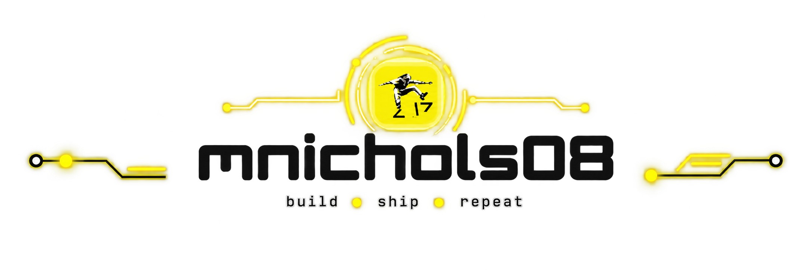

<a href="https://mnix.dev" target="_blank">
<picture>
  <source media="(prefers-color-scheme: dark)" srcset="./assets/banner-dark.png">
  
</picture>
</a>
<p align="center">
  <picture>
    <source media="(prefers-color-scheme: dark)" srcset="https://streak-stats.demolab.com?user=mnichols08&hide_border=true&background=111111&stroke=E3DE13&ring=E3DE13&fire=E3DE13&currStreakLabel=E3DE13&currStreakNum=ffffff&sideLabels=ffffff&sideNums=ffffff&dates=b6b211">
    
  </picture>
</p>
<p align="center">
  <picture>
    <source media="(prefers-color-scheme: dark)" srcset="https://readme-typing-svg.demolab.com?font=Fira+Code&size=22&duration=3000&pause=1000&color=E3DE13&center=true&vCenter=true&width=600&lines=Full-Stack+Developer;Building+with+React+%26+Node.js;Exploring+Rust+%2B+WebAssembly;Web+Components+Enthusiast">
    
  </picture>
</p>
<br>

<p align="center">
  <a href="https://mnix.dev">
    
  </a>
  <a href="https://journeytocode.io">
    
  </a>
  <a href="https://linkedin.com/in/mnix-dev">
    
  </a>
  <a href="https://mnix.dev/file/mnichols-cv.pdf">
    
  </a>
</p>

---

# About Me

I build web applications, from the interface and API to the tests that check how they work together.

I'm drawn to the engineering around the feature as much as the feature itself — **testing, accessibility, authentication, application architecture, deployment, and making frontend and backend systems work well together.**

Right now I'm pushing into **Rust and WebAssembly** — using WASM for compute-heavy domain logic behind native Web Component UIs with no framework in the render path. I write about what I learn at **[Journey to Code](https://journeytocode.io)**.

---

# Technical Stack

Core: **JavaScript · TypeScript · React · Node.js · Express · Web Components · Rust/WebAssembly**

<details>
<summary><strong>Full stack &amp; tooling</strong></summary>

## Frontend

<p>
  
  <picture>
    <source media="(prefers-color-scheme: dark)" srcset="https://img.shields.io/badge/React-111111?style=for-the-badge&logo=react&logoColor=61DAFB">
    
  </picture>
  <picture>
    <source media="(prefers-color-scheme: dark)" srcset="https://img.shields.io/badge/Next.js-111111?style=for-the-badge&logo=nextdotjs&logoColor=white">
    
  </picture>
  <picture>
    <source media="(prefers-color-scheme: dark)" srcset="https://img.shields.io/badge/Web_Components-111111?style=for-the-badge&logo=webcomponents.org&logoColor=E3DE13">
    
  </picture>
  <picture>
    <source media="(prefers-color-scheme: dark)" srcset="https://img.shields.io/badge/HTML5-111111?style=for-the-badge&logo=html5&logoColor=E34F26">
    
  </picture>
  <picture>
    <source media="(prefers-color-scheme: dark)" srcset="https://img.shields.io/badge/CSS3-111111?style=for-the-badge&logo=css&logoColor=1572B6">
    
  </picture>
</p>

## Backend & APIs

<p>
  <picture>
    <source media="(prefers-color-scheme: dark)" srcset="https://img.shields.io/badge/Node.js-111111?style=for-the-badge&logo=nodedotjs&logoColor=5FA04E">
    
  </picture>
  <picture>
    <source media="(prefers-color-scheme: dark)" srcset="https://img.shields.io/badge/Express-111111?style=for-the-badge&logo=express&logoColor=white">
    
  </picture>
  <picture>
    <source media="(prefers-color-scheme: dark)" srcset="https://img.shields.io/badge/REST_APIs-111111?style=for-the-badge&logo=fastapi&logoColor=E3DE13">
    
  </picture>
  <picture>
    <source media="(prefers-color-scheme: dark)" srcset="https://img.shields.io/badge/MongoDB-111111?style=for-the-badge&logo=mongodb&logoColor=47A248">
    
  </picture>
  <picture>
    <source media="(prefers-color-scheme: dark)" srcset="https://img.shields.io/badge/PostgreSQL-111111?style=for-the-badge&logo=postgresql&logoColor=4169E1">
    
  </picture>
  <picture>
    <source media="(prefers-color-scheme: dark)" srcset="https://img.shields.io/badge/Airtable-111111?style=for-the-badge&logo=airtable&logoColor=18BFFF">
    
  </picture>
</p>

## Testing & Quality

<p>
  <picture>
    <source media="(prefers-color-scheme: dark)" srcset="https://img.shields.io/badge/TypeScript-111111?style=for-the-badge&logo=typescript&logoColor=3178C6">
    
  </picture>
  <picture>
    <source media="(prefers-color-scheme: dark)" srcset="https://img.shields.io/badge/Vitest-111111?style=for-the-badge&logo=vitest&logoColor=6E9F18">
    
  </picture>
  <picture>
    <source media="(prefers-color-scheme: dark)" srcset="https://img.shields.io/badge/Jest-111111?style=for-the-badge&logo=jest&logoColor=C21325">
    
  </picture>
  <picture>
    <source media="(prefers-color-scheme: dark)" srcset="https://img.shields.io/badge/React_Testing_Library-111111?style=for-the-badge&logo=testinglibrary&logoColor=E33332">
    
  </picture>
  <picture>
    <source media="(prefers-color-scheme: dark)" srcset="https://img.shields.io/badge/Playwright-111111?style=for-the-badge&logo=playwright&logoColor=45BA4B">
    
  </picture>
  <picture>
    <source media="(prefers-color-scheme: dark)" srcset="https://img.shields.io/badge/ESLint-111111?style=for-the-badge&logo=eslint&logoColor=4B32C3">
    
  </picture>
  <picture>
    <source media="(prefers-color-scheme: dark)" srcset="https://img.shields.io/badge/Prettier-111111?style=for-the-badge&logo=prettier&logoColor=F7B93E">
    
  </picture>
</p>

## Workflow & Deployment

<p>
  <picture>
    <source media="(prefers-color-scheme: dark)" srcset="https://img.shields.io/badge/Git-111111?style=for-the-badge&logo=git&logoColor=F05032">
    
  </picture>
  <picture>
    <source media="(prefers-color-scheme: dark)" srcset="https://img.shields.io/badge/GitHub-111111?style=for-the-badge&logo=github&logoColor=white">
    
  </picture>
  <picture>
    <source media="(prefers-color-scheme: dark)" srcset="https://img.shields.io/badge/GitHub_Actions-111111?style=for-the-badge&logo=githubactions&logoColor=2088FF">
    
  </picture>
  <picture>
    <source media="(prefers-color-scheme: dark)" srcset="https://img.shields.io/badge/Vite-111111?style=for-the-badge&logo=vite&logoColor=646CFF">
    
  </picture>
  <picture>
    <source media="(prefers-color-scheme: dark)" srcset="https://img.shields.io/badge/Postman-111111?style=for-the-badge&logo=postman&logoColor=FF6C37">
    
  </picture>
  <picture>
    <source media="(prefers-color-scheme: dark)" srcset="https://img.shields.io/badge/Netlify-111111?style=for-the-badge&logo=netlify&logoColor=00C7B7">
    
  </picture>
  <picture>
    <source media="(prefers-color-scheme: dark)" srcset="https://img.shields.io/badge/Render-111111?style=for-the-badge&logo=render&logoColor=white">
    
  </picture>
</p>

</details>

---

<details open>
<summary><strong>GitHub metrics &amp; project constellation</strong></summary>

<p align="center">
  <picture>
    <source media="(prefers-color-scheme: dark)" srcset="https://raw.githubusercontent.com/mnichols08/mnichols08/output/metrics-dark.svg">
    
  </picture>
</p>

<p align="center">
  <picture>
    <source media="(prefers-color-scheme: dark)" srcset="https://raw.githubusercontent.com/mnichols08/mnichols08/output/metrics.isocalendar-dark.svg">
    
  </picture>
</p>

[](https://github.com/mnichols08/constellation)

</details>

---

# Selected Work

<details>
<summary><strong>Seven featured projects — each links to a full case study on mnix.dev</strong></summary>

### ✨ [Constellation · Case study](https://mnix.dev/projects/constellation)

_In development._ Turns GitHub repositories into interactive project maps and README-ready SVGs.

<details>
<summary>Build notes &amp; technologies</summary>

I built a shared Rust graph engine for the browser, command line, and GitHub Action, alongside an accessible web-component Studio.

`Rust` `WebAssembly` `Web Components` `SVG` `GitHub Actions`

</details>

---

### 📝 [Readme Studio · Case study](https://mnix.dev/projects/readme-studio)

_In development._ A browser-based GitHub profile README editor with editable sections, Markdown import and export, and a live preview.

<details>
<summary>Build notes &amp; technologies</summary>

Built with native Web Components and local drafts, with optional WebAssembly analysis.

`JavaScript` `Web Components` `WebAssembly` `PWA` `Playwright`

</details>

---

### 📚 [open.quiz · Case study](https://mnix.dev/projects/open-quiz)

An open-source, self-hostable learning platform independently evolved from Sprout.

<details>
<summary>Build notes &amp; technologies</summary>

I built modular curricula, administrator-managed themes and content packages, and a single-service React and Express deployment.

`React` `Node.js` `Express` `MongoDB` `Playwright`

</details>

---

### 🗺️ [Garrett County Adventures · Case study](https://mnix.dev/projects/gc-adventures)

_In development._ A local-first trip-planning site for Garrett County, Maryland.

<details>
<summary>Build notes &amp; technologies</summary>

I built a framework-free TypeScript explorer, local Rust/WebAssembly GPX analysis, saved outings, and a Markdown-to-guide publishing pipeline.

`TypeScript` `Rust` `WebAssembly` `OpenStreetMap` `PWA`

</details>

---

### 💵 [Drawer Count · Case study](https://mnix.dev/projects/drawer-count)

An installable cash-drawer calculator for repeat counts and daily records.

<details>
<summary>Build notes &amp; technologies</summary>

I built the counting interface as a Custom Element with Shadow DOM and custom events, then added on-device storage and offline caching.

`JavaScript` `Web Components` `PWA` `Service Workers`

</details>

---

### 🥫 [Kitchen Inventory · Case study](https://mnix.dev/projects/kitchen-inventory)

My individual capstone: a React app for tracking food, expiration dates, and shopping needs.

<details>
<summary>Build notes &amp; technologies</summary>

I built the inventory flows, routed Airtable requests through a serverless function, and added local persistence.

`React` `Vite` `Airtable` `Netlify Functions`

</details>

---

### ✅ [CTD Todo App · Case study](https://mnix.dev/projects/ctd-todo-app)

A React task manager with Airtable-backed tasks and searchable, sortable lists — extended from a Code the Dream guided project.

<details>
<summary>Build notes &amp; technologies</summary>

I added optimistic updates with rollback, caching, and regression tests for failures and keyboard interactions.

`React` `Airtable` `Vite` `Vitest` `React Testing Library`

</details>

</details>

---

# Current Build: Swing or Cast

**[Swing or Cast](https://mnix.dev/projects/swing-or-cast)** is an in-development browser RPG where each expedition risks permanent character death. A shared Rust game core powers both the server and a WebAssembly adapter for the browser, keeping combat and progression rules identical on both sides. [Try the live demo](https://swing-or-cast.journeytocode.io/) · [View the source](https://github.com/mnichols08/rust-swing-or-cast)

<details>
<summary>⚔️ See how the Rust game core reaches the browser</summary>

The `GameWasm` struct wraps the core game and exposes it to JavaScript. Each method applies an action through the Rust engine, then serializes the updated state back to the browser:

```rust
use wasm_bindgen::prelude::*;

#[wasm_bindgen]
pub struct GameWasm {
    game: Game,
}

#[wasm_bindgen]
impl GameWasm {
    pub fn venture(&mut self) -> Result<JsValue, JsValue> {
        self.game.venture().map_err(js_error)?;
        self.snapshot()
    }

    pub fn snapshot(&self) -> Result<JsValue, JsValue> {
        serde_wasm_bindgen::to_value(&self.game.snapshot()).map_err(js_error)
    }
}
```

[See the full WebAssembly adapter →](https://github.com/mnichols08/rust-swing-or-cast/blob/development/crates/game-wasm/src/lib.rs)

</details>

---

# Technical Writing

I write at **[Journey to Code](https://journeytocode.io)** about the things I'm building and learning — JavaScript, Web Components, Git, application architecture, and experiments worth understanding beyond just getting the code to work.

<details>
<summary>📚 Featured series</summary>

- **[Commit to Success: Mastering Git](https://journeytocode.io/series/learn-git-from-basics-to-advanced)** — Moving beyond basic commands to master version control, branches, merging, and real-world collaboration.
- **[Journey to Web Components](https://journeytocode.io/series/web-components-fundamentals-to-advanced)** — Building reusable UI architecture without heavy frameworks using Custom Elements, Shadow DOM, and native browser APIs.
- **[Mastering the Fetch API & Browser Storage](https://journeytocode.io/series/mastering-fetch-api-browser-storage)** — Network requests, client-side persistence (IndexedDB, Cache API), and resilient offline-first design.
- **[Mastering the Web Audio API](https://journeytocode.io/series/complete-web-audio-api-tutorial)** — Exploring creative coding, spatial audio, synthesis, and processing directly in the browser.
- **[Coding Patterns Demystified](https://journeytocode.io/coding-patterns-demystified)** — A deep dive into the Model-View-Controller pattern with shipping code.

</details>

<details>
<summary>✍️ Recent articles</summary>

> Automatically synchronized from journeytocode.io via GitHub Actions.

<!-- BLOG-POST-LIST:START -->
- [What a Long, Strange Trip...](https://journeytocode.io/what-a-long-strange-trip) — The last time I posted was on April 28, 2025. I know the exact date because it was the same day I got married. Looking b...
- [From DOS to Desktop Disasters](https://journeytocode.io/from-dos-to-desktop-disasters) — I grew up as the youngest offspring of one particularly tech-savvy individual who among many jobs, initially moved our f...
- [The Future of Web Components](https://journeytocode.io/the-future-of-web-components) — Web Components have come a long way since their introduction, evolving from a niche standard to a cornerstone of modern...
- [Advanced Patterns &amp; Integration with Frameworks](https://journeytocode.io/advanced-patterns-and-integration-with-frameworks) — Web Components promise the holy grail of front-end development: truly reusable, framework-agnostic components that work...
- [Real-World Examples &amp; Patterns in Web Components](https://journeytocode.io/real-world-examples-and-patterns-in-web-components) — In today&#39;s diverse front-end landscape, Web Components stand out as a platform-native solution for creating reusable UI...
<!-- BLOG-POST-LIST:END -->

</details>

---

# Open to Roles

Looking for full-stack and frontend positions where **performance, offline-first design, and framework-agnostic UI** are taken seriously.

**[Portfolio](https://mnix.dev)** · **[Journey to Code](https://journeytocode.io)** · **[LinkedIn](https://linkedin.com/in/mnix-dev)** · **[Resume](https://mnix.dev/file/mnichols-cv.pdf)**

<br>
<details>
<summary>Please don't mind me, just feeding my snake down here...</summary>

<picture width="100%">
  <source media="(prefers-color-scheme: dark)" srcset="https://raw.githubusercontent.com/mnichols08/mnichols08/output/github-snake-dark.svg">
  <source media="(prefers-color-scheme: light)" srcset="https://raw.githubusercontent.com/mnichols08/mnichols08/output/github-snake.svg">
  
</picture>
</details>
